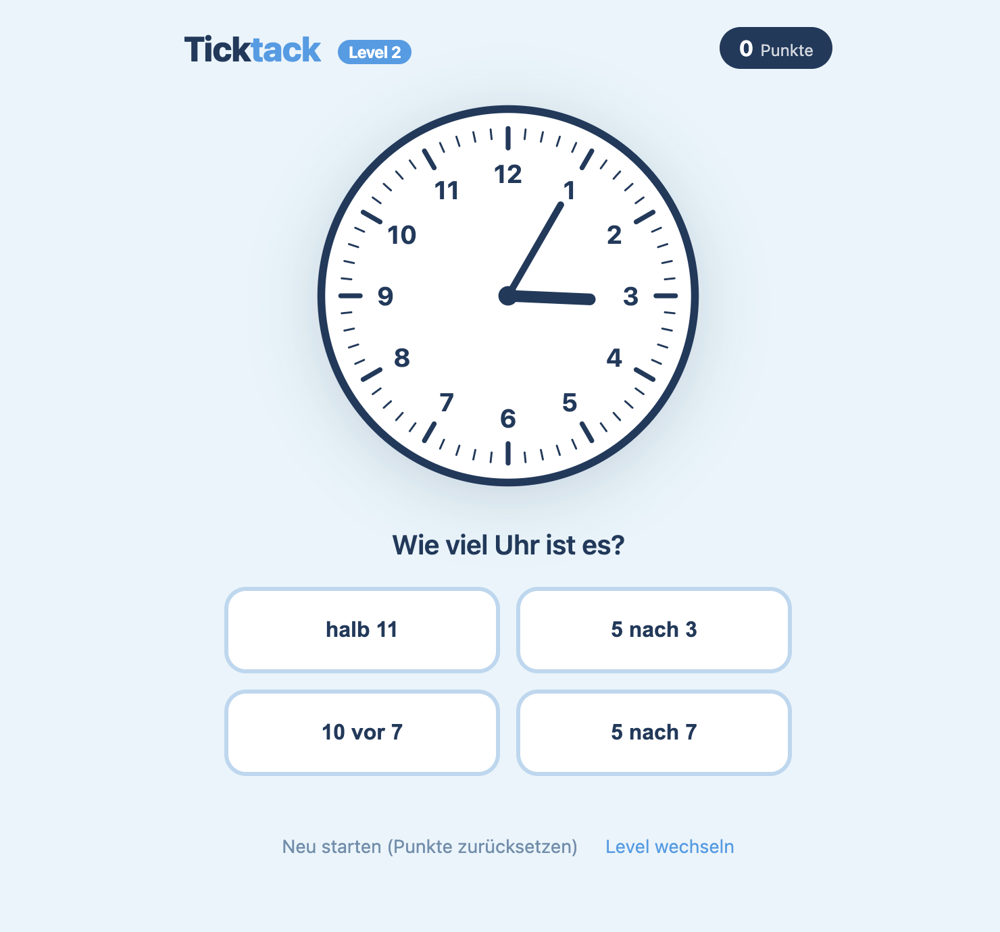

# Ticktack – Uhr lesen lernen

Ein kindgerechtes Lernspiel zum Ablesen analoger Uhren, entwickelt mit PHP und reinem HTML/CSS/SVG – ohne Datenbank, ohne Framework.



## Features

- **4 Schwierigkeitsgrade**
  - **Anfänger** – volle Stunden, viertel nach, halb, viertel vor
  - **Leicht** – alle 5-Minuten-Schritte (z. B. „5 vor halb 7", „10 nach 4")
  - **Mittel** – wie Leicht, aber die analoge Uhr zeigt nur 12, 3, 6 und 9
  - **Schwer** – wie Mittel, aber gefragt wird die Uhrzeit in einer Viertelstunde, einer halben Stunde oder einer Stunde
- Analoge SVG-Uhr mit Stunden- und Minutenzeiger
- 4 Antwortoptionen zum Antippen (Multiple Choice)
- Punktestand & Fehlerzähler pro Session
- Tier-Belohnungen alle 10 Punkte mit animiertem Overlay
- Tier-Sammlung wird in der Session gespeichert
- Konfetti-Animation bei richtiger Antwort
- Vollständig responsive, mobilfreundlich
- Kein JavaScript-Framework, keine Datenbank

## Voraussetzungen

- PHP 8.0+
- Ein Webserver (Apache, Nginx, o. ä.) mit aktivierten PHP-Sessions

## Installation

```bash
git clone https://github.com/anwiese/ticktack.git
# Dateien in das Document-Root des Webservers legen
```

Das war's. Keine Abhängigkeiten, keine Konfiguration, kein Build-Schritt.

## Technischer Überblick

| Schicht | Technologie |
|--------|-------------|
| Backend | PHP 8 (Sessions, CSRF-Schutz) |
| Uhr | SVG, server-seitig gerendert |
| Styling | Reines CSS (keine externen Frameworks) |
| Emojis | [Twemoji](https://github.com/twitter/twemoji) (CDN) |
| Konfetti | [canvas-confetti](https://github.com/catdad/canvas-confetti) (CDN) |

## Lizenz

MIT – siehe [LICENSE](LICENSE)
